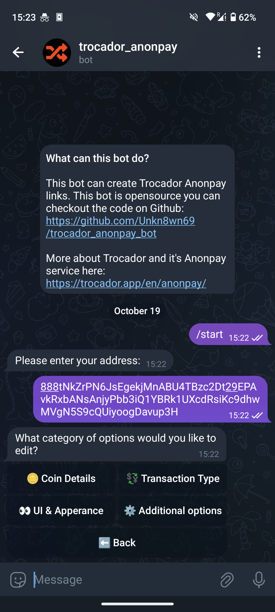

# Unoffical Trocador Anonpay bot

This is a telegram bot for the generation of trocador anonpay urls

## Demo

[Preview Video](https://streamable.com/yydnm1)

The bot is currently availiable on Telegram at [@unoffical_anonpay_bot](https://t.me/unoffical_anonpay_bot)

## Screenshots

|  |  |  |  |
| :-----------------------------------------: | :----------------------------------------: | :---------------------------------------: | :----------------------------------------------------: |
|                   Start                   |                 Overview                 |                 Options                 |                   All option menus                   |

## Features

* [X] Set coin and address
* [X] Gather Anonpay url
* [X] Change Anonpay design
* [X] Change Anonpay options
* [X] Get Tor & I2P links
* [X] Demo bot hosting
* [X] Reset conversation with the `/reset` command
* [ ] Automatically validate user input e.g the receiving address
* [ ] Localized bot language
* [ ] Save and Load configurations
* [ ] Get notifications for ongoing tansfers via the bot

## Prerequisites

- Python 3.9+
- A [Telegram bot](https://core.telegram.org/bots#6-botfather) and its token (see [tutorial](https://core.telegram.org/bots/tutorial#obtain-your-bot-token))

## Credits

- [Anonpay](https://trocador.app/en/anonpay/) from [Trocador](https://trocador.app/en/)
- [python-telegram-bot](https://python-telegram-bot.org)

## Donations

If you find this project useful, please consider donating to the following Monero address: (Or for other cryptos [here](https://trocador.app/anonpay/?ticker_to=xmr&network_to=Mainnet&address=89ZYSD9nyFxZS1zrZaB9Z4giuv776AeKTMXVRWPMkZDtau7wF2DCgqc1tH9zAVszPTP9XTSnhLT4rYUhW6oP8okeS56Jbdc&donation=True&simple_mode=True&name=Unkn8wn69))

89ZYSD9nyFxZS1zrZaB9Z4giuv776AeKTMXVRWPMkZDtau7wF2DCgqc1tH9zAVszPTP9XTSnhLT4rYUhW6oP8okeS56Jbdc

or if you want to donate to Trocador do that [here](https://trocador.app/en/about/)

## Disclaimer

This is a personal project and is not affiliated with Trocador in any way.

## License

This project is released under the terms of the GPL 3.0 license. For more information, see the [LICENSE](LICENSE) file included in the repository.
